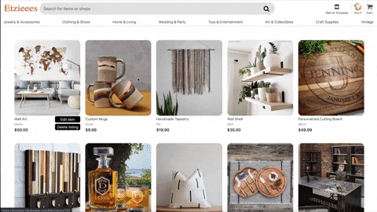
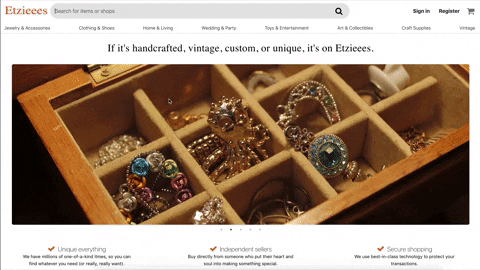

# Etzieees

Etzieees is a clone of the e-commerce website Etsy, which focuses on unique or handmade creative goods.

[**Etzieees Live Demo**](https://etzieees.herokuapp.com/)


## Technologies
Frontend
* React.js
* Redux.js
* HTML5
* CSS

Backend
* Ruby on Rails
* PostgreSQL

Etzieees was built using Ruby on Rails framework with a PostgreSQL Databse for the backend. The dynamic frontend was built using React.js and Redux for an interactive usability single-page app. Amazon Web Services S3 was used to store uploaded images.

## Features 
* Secure backend to frontend user authentication using Bcrypt
* Users can customize their portfolio - upload a profile image, update users information, and post product listings
* Users are able to create, edit, and delete a product listing 
* Users can add, update, and remove products from their shopping cart
* Allow users to search for products through search bar
* Products can be filtered based on its catergory

### Cart


```javascript
handleAddToCart(e) {
  e.preventDefault();
  if (!this.props.userId) {
    this.props.openModal('login')
  } else {
    this.props.addCartItem(this.state)
      .then(() => (this.props.history.push(`/cart`)))
  }
}
```
* Product will be added to the user's cart upon successful submission of the 'Add to cart' button, which is when the user is logged in. Otherwise, the user is prompted to log in to continue the action. 

<br/>  

```javascript

const {allCartItems} = this.props;

let allItems = this.props.allCartItems.map(item => {
  return (
    <CartIndexItem 
      key={item.id}
      item={item}
      deleteCartItem={this.props.deleteCartItem}
      updateCartItem={this.props.updateCartItem}
    />
  )
})

let title = (allCartItems.length < 2 ) ? 
  <h2 className="total-items">{allCartItems.length} item in your cart</h2> :
  <h2 className="total-items">{allCartItems.length} items in your cart</h2>
  
if (allCartItems.length === 0) {
return (
  <div className="cart-empty-div">
    <div className="cart-empty-container">
      <h3>Your cart is empty.</h3>
      <p>Discover something unique to fill it up</p>
    </div>
  </div>
  )
} 
```
* Cart will display all products added. Otherwise, a message will display to the user the cart is empty. 

### Category

```javascript
const mapDTP = (dispatch, ownProps) => {
 const validatePath = () => {
  if (ownProps.match.path === '/products') {
    return dispatch(fetchAllProducts());
  } 
  else if (ownProps.match.path === '/category/:category' ) {
     return dispatch(fetchCategory(ownProps.match.params.category))
  } else {
     return dispatch({ type: "null_action" }); 
  }
 }
 return {action: () => validatePath(),
   deleteProduct: productId => dispatch(deleteProduct(productId)) }
};
```
* Depending on the path, either an action to retrieve all products or an action to retrieve products with the correct category type will be called. 

### Search

```ruby
def search 
 search_query = params[:query].downcase 
  @products = Product.all.select do |product|
    title = product.title.downcase
    seller = product.seller.name.downcase
    (title.include?(search_query) || seller.include?(search_query))
 end
 
 render :index
end
```
```javascript
handleSubmit(e) {
 e.preventDefault();
 e.stopPropagation();
 this.props.fetchSearchProducts(this.state.query).then(() => {
   this.props.history.push("/search")
 })
}
 ```
 * Allow users to search by product title and seller name.

## Future Development
* Product reviews 
* User reviews for procducts

